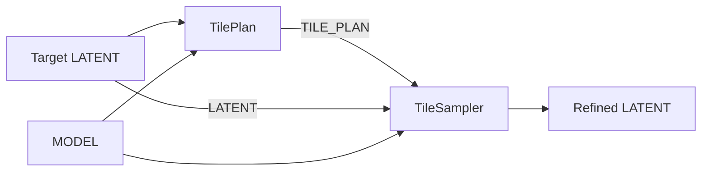

# Tiled Diffusion NG: design and implementation plan

Design baseline: 2026-09-18. This document defines the implementation target;
it does not claim that the nodes, model support, or GPU comparisons already exist.

## 1. Purpose and settled decisions

Build a new ComfyUI custom node package that reimplements the Mixture of
Diffusers concept. The implementation belongs to this project; ComfyUI-TiledDiffusion
is an integration and comparison reference. This is a complete reimplementation,
not a fork or a compatibility layer for the upstream package.

The initial workflow refines one target-resolution latent through four overlapping
quadrant views at any supported input geometry. For example, a roughly 4MP canvas
has four roughly 1MP quadrant cores, with 64–128 pixels of shared overlap added
as sampling context. These example dimensions and areas are not runtime constants.
TilePlan computes the expanded sampling bounds automatically. All views
read the same global latent at each model evaluation; their predictions are fused
before ComfyUI's sampler advances the global state.

The following decisions govern the implementation:

- Mixture of Diffusers is the only tiled diffusion method. There is no method selector.
- Generate exactly four tiles in a fixed 2×2 arrangement. Tile count is internal;
  a later version can make it configurable.
- The public order is clockwise: **TL, TR, BR, BL**. The brainstorm's row-major
  TL/TR/BL/BR ordering is superseded everywhere, including images and conditioning.
- `TilePlan` takes a `MODEL`, a `LATENT`, and `tile_overlap`. It computes geometry
  and outputs **only `TILE_PLAN`**. Connect the same source LATENT directly to
  TileSampler. Planning does not transform, sample, or output a latent.
- `TileView` accepts `image` and `tile_plan`, returning one batch of overlapping
  crops. The caller supplies an image with exactly the plan's pixel dimensions.
- `TileSampler` wraps normal ComfyUI KSampler behavior and adds a tile plan and
  an optional array of four complete positive `CONDITIONING` values.
- A local positive replaces the global positive for that tile. Negative conditioning
  and CFG remain shared. There is no automatic prompt concatenation or extra global pass.
- Prefer the original paper's mathematics. Reproduce an upstream difference only
  when there is an explicit, documented reason. Numerical identity with an upstream
  defect is not an acceptance criterion.
- The first milestone is a favorable manual SDXL comparison with upstream,
  followed through with local conditioning, ordinary SDXL Tile ControlNet, and
  native KSampler choices registered by RES4LYF. This gate precedes work beyond SDXL.
- Iterative pixel upscaling and iterative latent upscaling are both first-class
  workflows. A sampler's LATENT output can feed the next external upscale and stage.
- Future latent/model adapters are an architectural requirement from the start.
  Anima and Krea2 are definite follow-on targets; video remains outside this cut.

Keep VAE encoding/decoding, upscaling, text encoding, and VLM calls in ordinary
external workflow nodes. Do not add tiled VAE, noise inversion, moving windows,
independent per-tile samplers, per-tile seeds, or image stitching.

## 2. Sources and the mathematical discrepancy

### 2.1 Pinned references

Use these revisions for the initial desk check and record the actual host revision
again when performing GPU comparisons. Links to code below are pinned to these
revisions rather than to a moving branch.

| Reference | Revision / link | Role |
| --- | --- | --- |
| Álvaro Barbero Jiménez, *Mixture of Diffusers for scene composition and high resolution image generation* | [arXiv:2302.02412v1, §§3.1–3.2, equations 15–16, Algorithm 1][paper] | Mathematical specification |
| Original Mixture of Diffusers implementation | [`af42292d0a8cb414f6da2eeac79be4c60afbbe48`][mod-repo] | Independent implementation reference |
| ComfyUI-TiledDiffusion | [`a155b1bac39147381aeaa52b9be42e545626a44f`][td-repo] | SDXL behavior, geometry, and ControlNet comparison |
| Gaussian correction proposal | [TiledDiffusion PR #77][gaussian-pr], head `1cac48dfcb1c5a17d15c3112a00e5b508dc90ad2` | Explicitly identifies the vertical denominator defect |
| ComfyUI | [`3c80da7f87ee359b2d06f107cb3c0797079dfbbb`][comfy-repo] | Inspected host API; confirm a tested supported baseline during implementation |
| RES4LYF | [`e8437efef69cacf3f08fbd9f90fcc517868c5cb8`][res-repo] | Samplers/schedulers registered into native ComfyUI KSampler only |
| Upstream 5D latent proposal | [TiledDiffusion PR #62][td-video-pr], head `265d5a4c33ee9e70cd9e569f2965df66368cb269` | Reference for preserving non-spatial axes; video support remains out of scope |
| GPU LayerStyles | [local project](../gpu-layerstyles/README.md), inspected HEAD `328a2e2a2b81b57d4e526a9722fff60419f47ac9` | Package layout, V3 registration, PyTorch ownership, attribution, and testing |
| ComfyUI OpenAI API | [local project](../comfyui-openai-api/README.md), inspected HEAD `3a7e4f94cf35c837d607dbee61fd714769e71a34` | Typed payloads, V3 integration, external VLM workflow, and packaging |

### 2.2 Findings that affect the design

The paper combines regional guided noise estimates with weights normalized at
each spatial position, then makes a global scheduler update. It specifies a
Gaussian centered on each region, with distances normalized independently by
region width and height and variance `0.01`. Each region has its own prompt;
the algorithm does not require an additional global prompt contribution. [Paper][paper]

There are two distinct Gaussian differences to track:

| Implementation | Horizontal center / scale | Vertical center / scale |
| --- | --- | --- |
| Original `mixdiff/canvas.py` | `(w - 1) / 2`, `w²` | `(h - 1) / 2`, `h²` |
| Original `mixdiff/tiling.py` | `(w - 1) / 2`, `w²` | `h / 2`, `h²` |
| Pinned ComfyUI-TiledDiffusion | `(w - 1) / 2`, `w²` | `h / 2`, **`w²`** |
| PR #77 patch | `(w - 1) / 2`, `w²` | `h / 2`, `h²` |
| This project's contract | `(w - 1) / 2`, `w²` | `(h - 1) / 2`, `h²` |

See the original [canvas kernel][mod-canvas], original [tiling kernel][mod-tiling],
and [TiledDiffusion kernel][td-gaussian]. PR #77 was open at the design baseline.
Its patch corrects the denominator; the discussion also identifies the midpoint
asymmetry. The PR alone does **not** fix both differences. [PR and discussion][gaussian-pr]

Use symmetric discrete centers and independent axis scales. This follows the
paper's centered Gaussian and agrees with the author's canvas implementation.
No deliberate mathematical rationale for the two asymmetries was found in the
inspected material. A separate formal paper erratum was not located; distinguish
the repository correction from a published erratum.

Consequently, even square-tile results can differ from stock TiledDiffusion due
to the midpoint change. Rectangular tests are necessary to expose the denominator
defect. Do not ship a legacy Gaussian option just to make a comparison pass.

### 2.3 Source map for implementation

| Concern | Read before implementing |
| --- | --- |
| Global sampling and noise preparation | [`nodes.common_ksampler` and `KSampler`][comfy-ksampler]; [`comfy/sample.py`][comfy-sample] |
| Conditioning preparation, conditional evaluation, and CFG | [`comfy/samplers.py`][comfy-samplers]: `process_conds`, `calc_cond_batch`, `sampling_function`, `cfg_function`, `CFGGuider` |
| Composable wrappers | [`WrappersMP` and `WrapperExecutor`][comfy-wrappers]; [`ModelPatcher`][comfy-patcher]: `clone`, `add_wrapper_with_key` |
| Additional model discovery and cleanup | [`comfy/sampler_helpers.py`][comfy-sampler-helpers] |
| Model output representation | [`BaseModel.apply_model` / `_apply_model`][comfy-apply-model]; [`EPS.calculate_denoised` and other conversions][comfy-model-sampling] |
| ControlNet state and image preparation | [`comfy/controlnet.py`][comfy-controlnet]; [`ControlNetApplyAdvanced`][comfy-control-apply] |
| V3 schema and list transport | [`comfy_api/latest/_io.py`][comfy-io]: `Custom`, `Conditioning`, `Schema.is_input_list`, `Output.is_output_list` |
| Latent family metadata | [`comfy/latent_formats.py`][comfy-latents]; [`comfy/supported_models.py`][comfy-supported]; [SDXL UNet spatial-size handling][comfy-unet] |
| Upstream geometry and fusion | [`split_bboxes`][td-geometry]; [`MixtureOfDiffusers`][td-mod] |
| RES4LYF native registration and call path | [Root registration][res-registration], [native sampler exports][res-native-samplers], [RK model calls][res-model-calls] |

## 3. Workflow and public nodes

Each stage fans the target latent out to the planner and sampler. The planner's
only outgoing connection is its geometry payload:



The two supported sources of that target latent are:

1. Pixel refinement: source image → external pixel upscale → VAE encode →
   the stage above. Decode the result when a pixel image is needed.
2. Latent refinement: source image → VAE encode → external latent upscale →
   the stage above. Decode only at a caller-selected point, commonly after the
   final refinement stage.

Composition across stages is part of the initial contract:

```text
target_latent_i  = external_latent_upscale(refined_latent_previous)
plan_i          = TilePlan(model_i, target_latent_i, tile_overlap_i)
refined_latent_i = TileSampler(model_i, target_latent_i, plan_i, ...)
```

Repeat this graph for as many stages as the caller chooses. There is no implicit
VAE decode/encode between latent stages. For iterative pixel refinement, explicitly
decode a stage's result, upscale its pixels, encode, and feed the next stage.
Mixing the two paths is also valid when the resulting latent matches the next
model's format. These are capabilities of the new node contracts, not a claim that
the upstream model patch intrinsically requires pixel-domain upscaling.

Compute a new plan whenever the target geometry or model geometry contract changes.
A plan for an earlier resolution must fail validation at the next sampler rather
than being silently stretched. Reuse is allowed when the geometry contract is
unchanged. Each sampler stage owns its seed/noise initialization, denoise value,
schedule, and transient state; a chain is a sequence of ordinary refinement runs,
not one solver history continued through an external resize.
Each stage still has exactly four tiles. Their area grows with that stage's
canvas; the 1MP-core example applies to a roughly 4MP canvas, not a hidden target
area that would increase tile count at later resolutions.

The optional vision branch is independent: source image → external pixel upscale
to the plan's full dimensions → `TileView` → external captioning → external text
encoding → four local conditionings. Both representations share geometry, not
pixel contents. A decoded, unrefined upscaled latent is not required for captioning.
At every later stage, supply a pixel reference matching that stage's plan; it can
be another crisp pixel upscale of the source. Captions are optional at every stage.

Register three V3 nodes, using a project-specific category such as
`Tiled Diffusion NG`. Use stable namespaced IDs to avoid collisions with other
extensions; the short class names remain the names used in this document.

| Class | Proposed stable node ID | Display name | Outputs |
| --- | --- | --- | --- |
| `TilePlan` | `TiledDiffusionNG_TilePlan` | Prepare Four Tile Plan | `tile_plan: TILE_PLAN` |
| `TileView` | `TiledDiffusionNG_TileView` | Extract Four Vision Views | `tiles: IMAGE` |
| `TileSampler` | `TiledDiffusionNG_TileSampler` | Sample Four Tiles | `latent: LATENT` |

### 3.1 TilePlan

Required inputs:

| Input | Type | Contract |
| --- | --- | --- |
| `model` | `MODEL` | Read model metadata through an adapter; do not run or load the denoiser merely to plan geometry |
| `latent` | `LATENT` | Target-resolution latent; preserve the dictionary and all of its contents |
| `tile_overlap` | `INT` | Requested shared overlap in **pixels**, on both spatial axes; initial default `64`, minimum `0`, widget step `8` |

The overlap is the shared width between adjacent sampling rectangles. In the
ordinary even, aligned case, each neighboring core gains half that width across
their shared boundary: a 64-pixel overlap adds 32 pixels of context from each
side. Do not interpret it as a 64-pixel halo on each side, which would double the
shared overlap. Integer rounding can increase the actual overlap; the plan records
requested and effective values separately. Widget increments are an editing
convenience, not a substitute for runtime checks.

Both MODEL and LATENT contribute to the calculation. The latent supplies the
actual spatial extents and layout/metadata to validate. The model adapter supplies
the interpretation of those dimensions, pixel scale, crop lattice, minimum valid
extent, and supported format. The overlap request is converted through that scale
before calculating the four sampling rectangles. SDXL's scale happens to be fixed
at eight; it must not become a hardcoded assumption of the generic planner.

Read tensor shape and relevant metadata, not latent pixel values or denoiser
weights, to plan the geometry. Do not run model inference, resize, normalize,
remove metadata, or perform an empty-latent conversion. Return only `tile_plan`.
The payload holds geometry and a compatibility signature, not MODEL/LATENT references.

Do not expose tile width, tile height, tile count, alignment, Gaussian variance,
or tile batch size. "Ideal tile size" means the smallest equal, aligned tile
extent satisfying the requested overlap and complete coverage under this layout;
it is not an image-quality or VRAM optimization claim.

### 3.2 TileView

Inputs are `image: IMAGE` and `tile_plan: TILE_PLAN`. Use the name `image`, never
`vision_reference`. Validate an image tensor with shape `[B, H_px, W_px, C]`,
`B >= 1`, and supported image channels (RGB or RGBA).

- Require exact full pixel width and height from the plan. Report expected and
  received dimensions on mismatch. Do not resize, pad, or crop the full input to fit.
- Extract the **sampling** rectangles, including their overlap, using the plan's
  stored pixel bounds. Do not use the non-overlapping core rectangles.
- Return one ordinary IMAGE tensor, not four output sockets or an execution list.
  Its shape is `[4 * B, tile_H_px, tile_W_px, C]`.
- Batch order is image-major: image 0's TL/TR/BR/BL, then image 1's TL/TR/BR/BL,
  and so on. The IMAGE batch need not equal the latent batch used to create a plan.
- Preserve pixel values, channel order, dtype, and device; make a new crop batch
  without modifying the source. Do not draw labels on the returned crops.

"Exactly as sampled" describes the spatial rectangles. It does not mean a crop
of a separately supplied image equals decoding the sampler's latent, or that the
VAE's receptive field is confined to those rectangles.

Preview nodes and image batch splitters remain external. The sister VLM node
accepts multiple images in a request; it should not be assumed to emit one separate
caption per batch element. An external workflow must explicitly obtain four
ordered captions and encode them. See its [completion node][sister-completions].

### 3.3 TileSampler

Expose every ordinary KSampler input, retaining its names and behavior:

| Input | Initial host default / behavior |
| --- | --- |
| `model` | Required MODEL |
| `seed` | `0`, unsigned 64-bit range, normal frontend seed control |
| `steps` | `20`, same range as host KSampler |
| `cfg` | `8.0`, same range and increment as host KSampler |
| `sampler_name` | Options from `comfy.samplers.KSampler.SAMPLERS` at runtime |
| `scheduler` | Options from `comfy.samplers.KSampler.SCHEDULERS` at runtime |
| `positive` | Required global CONDITIONING |
| `negative` | Required shared CONDITIONING |
| `latent_image` | Required LATENT, connected directly from the same source as TilePlan's `latent` input |
| `denoise` | `1.0`, range `[0, 1]`, normal partial-denoise semantics |

Add required `tile_plan` and optional `local_positive`. Read sampler/scheduler
choices from the host rather than maintaining a copied list. Match host combo
defaults and seed controls. Validate names against the **live, extended** host
registries before execution, since internal KSampler code can otherwise fall back
to a different name. RES4LYF additions to native KSampler are in scope; section
7.6 defines the compatibility boundary. [Host node schema][comfy-ksampler]

Return the global sampled LATENT through the usual KSampler result path. Preserve
`noise_mask`, `batch_index`, and other metadata as the host does; allow the host's
documented consumption/removal of empty-latent bookkeeping keys. Do not return a
patched MODEL or a batch of independently sampled tiles.

KSampler Advanced controls and custom SIGMAS/SAMPLER/GUIDER sockets are outside
the first API. They are not options of the ordinary KSampler being wrapped here.

## 4. TILE_PLAN payload and geometry

Tiled diffusion lets the denoiser evaluate smaller spatial views while refining
a larger global latent. SDXL's multi-aspect training used buckets near
`1024²` pixels, so a working area around 1MP has a training-based motivation.
That is a useful scale, not a hard architectural limit or a guarantee of quality
at one exact width/height. [SDXL paper, §2.3 and Appendix I][sdxl-paper]

Separate that motivation from the layout policy:

| Quantity | Upstream TiledDiffusion | This implementation |
| --- | --- | --- |
| Sampling width/height, including overlapping pixels | Supplied by the caller | Computed from the canvas, overlap, and model constraints |
| Number of tiles | Derived from those extents and overlap | Four in a fixed 2×2 layout |
| Nominal quadrant cores | Not the upstream tile-size parameter | Quarter-canvas regions used to explain the layout |
| Adding overlap while covering the same canvas | Can increase the tile count when sampling extents are fixed | Increases sampling extents while retaining four tiles |

Both perform Mixture of Diffusers prediction fusion over the selected rectangles.
For a comparable experiment, feed this plan's computed **sampling** width/height
and overlap into upstream and verify matching bounds. Changing who computes the
geometry does not inherently prevent a comparison with the same views.

No 832/1216/1664/2432 dimension, SDXL training-bucket table, or 1MP target-area
constant belongs in the runtime planner. The only fixed layout choice is four
quadrants. A policy that holds sampling area near 1MP for arbitrarily large inputs
would instead need a variable tile count; that is separate later work. Training
bucket dimensions also do not establish the model's architectural crop lattice.

### 4.1 Payload

Use `io.Custom("TILE_PLAN")` and immutable Python data structures, such as frozen
dataclasses containing tuples. Define a versioned payload separate from the
`TilePlan` node class, for example `TilePlanData` and `TileRegion`.

| Field group | Required content |
| --- | --- |
| Version | `schema_version=1`, `layout="quadrants_2x2"`, `tile_count=4` |
| Order | Explicit tile IDs `("TL", "TR", "BR", "BL")` |
| Geometry signature | Adapter ID/version, latent format identity, layout/rank/channel requirements, spatial scale and alignment |
| Canvas | Latent `(H, W)` and full pixel `(H_px, W_px)` |
| Overlap | Requested pixel overlap; effective `(overlap_y, overlap_x)` in latent and pixel units |
| Tile extent | Common sampling height and width in both coordinate systems |
| Regions | Stable index/ID and core/sampling rectangles in latent and pixel coordinates |
| Fusion specification | Kernel recipe/version, normalized variance `0.01`, symmetric cell-center convention |

Represent rectangles as half-open `(x0, y0, x1, y1)`. Tensor slicing is
`[..., y0:y1, x0:x1]`; IMAGE slicing uses its BHWC axes. Name dimensions explicitly
at API boundaries to avoid width/height swaps.

Do not put CUDA tensors, model objects, conditioning objects, execution buffers,
or source images into the plan. Gaussian tensors are deterministic products of
the recorded geometry and recipe, created once per sampling invocation. This
keeps plan caching independent of GPU lifetime.

The signature checks geometry compatibility, not checkpoint equality. Different
checkpoints with the same supported geometry contract can reuse a plan. Latent
batch size is not a geometric constraint. A different spatial size, unsupported
rank, channel format, or adapter contract requires a new plan.

### 4.2 Derivation of four equal sampling rectangles

Let the latent canvas be `W × H`. Let `s_x, s_y` be the model's pixel-per-latent
spatial scales, and `a_x, a_y` its required crop-origin/extent alignment in latent
cells. Let `m_x, m_y` be its minimum valid tile extents in latent cells. For the
initial SDXL adapter the spatial scale is eight; other adapters
must obtain and verify their own metadata. Alignment comes from the adapter,
not from a user widget or a guessed multiple of eight pixels.

Convert the requested pixel overlap `p` upward, then solve for the minimum equal
tile extent along each axis:

```text
o_x = ceil(p / s_x)
o_y = ceil(p / s_y)

t_w = max(a_x * ceil((W + o_x) / (2 * a_x)), a_x * ceil(m_x / a_x))
t_h = max(a_y * ceil((H + o_y) / (2 * a_y)), a_y * ceil(m_y / a_y))

x_right  = W - t_w
y_bottom = H - t_h

effective_o_x = 2 * t_w - W
effective_o_y = 2 * t_h - H
```

Use integer ceiling division. Along the horizontal axis, full coverage with at
least the requested overlap requires `2*t_w - W >= o_x`, hence
`t_w >= (W + o_x)/2`. The other lower bound is `t_w >= m_x`. Rounding both bounds
up to the `a_x` lattice and taking their maximum gives the smallest feasible
aligned extent. The same proof applies vertically. Include the minimum-extent
bound rather than rejecting a small canvas when a larger valid tile would fit.

Require `W % a_x == 0` and `H % a_y == 0` so both edge-anchored origins are valid.
The strict `t_w < W`, `t_h < H` checks below determine whether a four-distinct-view
solution actually exists under these constraints. This is this project's fixed-
four geometry policy, derived from coverage; it is not a tile-size formula claimed
by the paper.

| Index | ID | Sampling rectangle |
| --- | --- | --- |
| 0 | TL | `(0, 0, t_w, t_h)` |
| 1 | TR | `(W-t_w, 0, W, t_h)` |
| 2 | BR | `(W-t_w, H-t_h, W, H)` |
| 3 | BL | `(0, H-t_h, t_w, H)` |

For the diagnostic non-overlapping cores, split at `floor(W/2)` and `floor(H/2)`.
The right/bottom cores receive any extra cell. These cores describe quadrant
ownership; fusion and TileView use sampling rectangles. Do not derive sampling
rectangles by independently expanding and clipping unequal cores.

Map each latent bound to pixels using its corresponding spatial scale. For the
initial integer-scale adapters this is exact multiplication. The contract must
be extended explicitly for a future format with a different mapping.

If rounding makes the actual overlap larger than requested, retain the valid
geometry and record both values. Even requested zero overlap can become one grid
unit of overlap when equal tile extents cannot divide an axis evenly. Show the
effective values in diagnostics and examples; do not pretend that rounding did
not happen. For `p=0`, exactly zero overlap is possible when `W` is divisible by `2*a_x`,
`H` is divisible by `2*a_y`, and the minimum tile extents do not exceed the halves.
The effective overlap can differ between axes. When minimum extent does not
dominate, rounding adds less than `2*a_x` or `2*a_y` cells to the respective
requested latent overlap.

### 4.3 Primary SDXL portrait example: four nominal 1MP tiles

A reference fixture is a **1664 × 2432** pixel portrait, with default overlap
**64** and 128 as a second common setting. These numbers appear in examples and
tests only; the same equations handle other input sizes. At SDXL's factor of eight, the latent
canvas is **208 × 304**. Its four quadrant cores are **104 × 152** latent cells,
or **832 × 1216** pixels each: 1,011,712 pixels per core, from a 4,046,848-pixel
canvas. These are nominal core sizes, before shared sampling context is added.

For a one-cell crop lattice, with minimum extent below the half-canvas size:

| Requested shared overlap | Sampling tile, latent `(w, h)` | Sampling tile, pixels `(w, h)` | Pixels per sampling tile | Tile count |
| --- | --- | --- | --- | --- |
| 0 px | `(104, 152)` | `(832, 1216)` | 1,011,712 | 4 |
| 64 px | `(108, 156)` | `(864, 1248)` | 1,078,272 | 4 |
| 128 px | `(112, 160)` | `(896, 1280)` | 1,146,880 | 4 |

At the default 64-pixel overlap, the clockwise sampling bounds are:

| ID | Latent `(x0, y0, x1, y1)` | Pixel `(x0, y0, x1, y1)` |
| --- | --- | --- |
| TL | `(0, 0, 108, 156)` | `(0, 0, 864, 1248)` |
| TR | `(100, 0, 208, 156)` | `(800, 0, 1664, 1248)` |
| BR | `(100, 148, 208, 304)` | `(800, 1184, 1664, 2432)` |
| BL | `(0, 148, 108, 304)` | `(0, 1184, 864, 2432)` |

At 128 pixels, the right origin is 768 pixels and the bottom origin is 1152
pixels; all four sampling crops are 896 × 1280. TileView returns these expanded
crops. Users choose overlap, while TilePlan owns all resulting extent/origin math.
The roughly 1MP size is a useful SDXL working size, not a universal quality
guarantee or a hard tile-area target that discards overlap.

For the manual upstream reference, set **sampling** width/height to 864 × 1248
at overlap 64, or 896 × 1280 at overlap 128. The pinned upstream splitter then
produces the same four rectangles. Its count rule, expressed in latent units, is:

```text
columns = ceil((W - o) / (tile_w - o))
rows    = ceil((H - o) / (tile_h - o))
```

Literal upstream sampling-size inputs 832 × 1216 with overlap 64 yield
`ceil(200/96) × ceil(296/144) = 3 × 3`. Such a nine-view run is a different
geometry experiment from this four-view fixture. Keep the main UX explanation
about four nominal quadrants plus context; use the expanded sampling dimensions
when configuring a comparison with matching views. [Upstream splitter][td-geometry]

### 4.4 Additional geometry checks

For a `2048 × 1536` pixel canvas, the latent is `256 × 192`. With `128` pixels
of overlap and a one-cell crop lattice, each sampling tile is `136 × 104` latent
cells, or `1088 × 832` pixels. The pixel bounds are:

| ID | Bounds `(x0, y0, x1, y1)` |
| --- | --- |
| TL | `(0, 0, 1088, 832)` |
| TR | `(960, 0, 2048, 832)` |
| BR | `(960, 704, 2048, 1536)` |
| BL | `(0, 704, 1088, 1536)` |

A `257 × 193` latent with the same overlap request needs `137 × 105` tiles;
effective overlap becomes `17` cells, or `136` pixels, along both axes. This
illustrates why requested and effective overlap cannot be one field.

### 4.5 Validation

Reject negative/non-integer overlap, invalid or empty tensors, unknown plan
versions, unsupported model families, incompatible model/latent metadata, and
canvas dimensions that cannot satisfy the adapter's crop grid.

An empty tensor here means a zero-length dimension, not an all-zero sample.
A correctly shaped all-zero SDXL latent remains a valid KSampler input.

Require four nonempty, distinct, model-valid rectangles, each strictly smaller
than the canvas along both axes: `0 < t_w < W`, `0 < t_h < H`. Reject overlap
so large that rounding produces duplicate full-width/full-height views. Do not
silently reduce tile count or clamp an impossible overlap.

Validate bounds, equal crop shapes, full coverage, core containment, and latent
to pixel mappings when constructing the plan. Revalidate schema/signature and
input compatibility in consumers; do not trust a mutated third-party payload.

## 5. Local conditioning contract and transport

The logical type of `local_positive` is an ordered sequence of **four complete
CONDITIONING objects**. A CONDITIONING object is already a list of embedding/
metadata entries. These two list levels have different meanings:

```text
one CONDITIONING = [[embedding, metadata], ...]
local_positive   = [conditioning_TL, conditioning_TR,
                    conditioning_BR, conditioning_BL]
```

Use native ComfyUI execution-list transport on an optional CONDITIONING socket:
set the TileSampler V3 schema's `is_input_list=True`. The node then receives the
outer execution list in one invocation. Unwrap and require one execution-list
item for each ordinary input; accept exactly four for `local_positive` when
connected. An absent optional socket selects the global fallback. Reject a
connected empty list, partial list, or array with the wrong nesting.

Ordinary global CONDITIONING arrives wrapped in a singleton execution list and
must remain intact after unwrapping. Never interpret its entry count as the tile
count. Do not use `ConditioningCombine` to construct the array: that combines
entries inside one CONDITIONING, which has different semantics.

For a manual local-prompt example, four normal text encoders can feed an external
list producer that preserves complete values, such as Impact Pack's
[`MakeAnyList`][conditioning-list-example]. Connect values 1–4 in TL/TR/BR/BL
order and verify the saved graph order. This is an optional example-workflow
dependency, not a runtime dependency or a fourth core node. The no-local workflow
needs no such helper. A VLM pipeline can produce the same execution list.

The initial sampler accepts tensor batches inside LATENT/CONDITIONING but does
not perform list-based sweeps over multiple models, plans, seeds, or step counts
within one invocation. Reject those multiple-item ordinary inputs clearly.

Selection rules are exact:

```text
positive_i = global_positive        if local_positive is absent
positive_i = local_positive[i]      otherwise
negative_i = shared_negative        before spatial ControlNet adaptation
```

An empty *text prompt* encoded into a valid CONDITIONING is still a real local
replacement. A malformed or empty CONDITIONING container is an error, not an
implicit fallback. There is no per-entry `None` fallback in the first version.

Replacement includes the complete positive object's metadata. In particular,
global-positive ControlNets do not silently survive replacement by a local
positive lacking those controls. Attach desired controls to the selected local
positives with ordinary ComfyUI nodes; the shared negative retains its own
metadata. Document this in the node tooltip and ControlNet example.

Preserve embedding tensors, pooled outputs, SDXL size/crop metadata, weights,
and timing metadata. Do not concatenate text or embeddings, substitute pooled
outputs from the global positive, or re-encode prompts inside the sampler.
Preserve explicit SDXL micro-conditioning values. When the host supplies missing
size defaults, prepare against the full canvas as the normal KSampler does;
do not silently replace those defaults with tile dimensions. [SDXL model code][comfy-sdxl]

## 6. Sampling mathematics and numerical policy

### 6.1 Regional predictions and normalized fusion

At one model evaluation, let `x` be the current global noisy latent, `R_i` its
crop for tile `i`, and `E_i` the operation that inserts a crop into an otherwise
zero global canvas. All four crops must come from the same `x` at the same sigma.

Let `P_i` and `N_i` be the tile's conditional and negative-branch predictions.
For shared guidance scale `c`, the conventional guided prediction is:

```text
G_i = N_i + c * (P_i - N_i)
```

A shared negative prompt is the usual ComfyUI extension of the paper's
unconditional branch. It does not add another spatial diffuser.

For positive Gaussian weights `g_i` inside each tile and zero contribution outside:

```text
D = sum_i E_i(g_i)
F(Q) = sum_i E_i(g_i * Q_i) / D
global_prediction = F(G)
```

Here `D` denotes the denominator; the paper's normalization tensor `Z` is `1/D`.
This naming distinction avoids accidentally applying the reciprocal twice.

The normalized contributions form a partition of unity wherever the canvas is
covered. Consequently, constant predictions stay constant, and overlap cannot
multiply prediction magnitude merely by increasing the contributor count.
With exactly zero overlap, each position has one contributor and its weight
cancels: fusion returns that tile's prediction there. Gaussian weighting alone
cannot smooth a boundary without shared coverage. Normalization guarantees
prediction-scale behavior; perceived smoothness remains a manual quality criterion.

This project's shared linear CFG allows the following implementation order:

```text
F(G) = F(N) + c * (F(P) - F(N))
```

Fuse the two branches separately and let ComfyUI apply CFG once to the resulting
full-canvas predictions. This identity is a derivation for common weights and
one linear CFG scale. It does not establish equivalence for nonlinear regional
guidance modifications or per-tile CFG values.

### 6.2 Gaussian definition

For a tile of width `w` and height `h` in latent cells, at integer indices
`u ∈ [0, w)` and `v ∈ [0, h)`:

```text
mu_x = (w - 1) / 2
mu_y = (h - 1) / 2
variance = 0.01

g(u, v) = exp(-0.5 / variance *
              (((u - mu_x) / w)^2 + ((v - mu_y) / h)^2))
```

This is the cell-center interpretation of a Gaussian centered on the rectangle.
The common Gaussian density prefactor `1/(2*pi*variance)` cancels in the
normalization and can be omitted. Do not add a per-axis size-dependent amplitude
or a per-tile gain: this contract has equal regional strengths. The standard
deviation in normalized coordinates is `sqrt(0.01) = 0.1`, not `0.01`.
Build the separable kernel with PyTorch; NumPy is not needed at runtime.
The kernel spans each full sampling rectangle, including its overlap.

Use FP32 as the minimum computation precision for kernels, denominators,
accumulation, and division. Preserve FP64 when the host prediction boundary uses
FP64, rather than silently reducing a sampler's numerical precision. For the
ordinary SDXL FP32 prediction path, accumulation remains FP32. Choose the working
dtype from the boundary contract, independently of the denoiser's weight dtype.
Use singleton dimensions for every non-spatial axis of the denominator, so it
broadcasts over batch, channels, and any adapter-supported temporal dimension.

Check that the denominator is finite and strictly positive everywhere before
sampling. Do not mask a coverage bug by clamping the denominator to an arbitrary
epsilon: valid edge weights are small, and clamping changes their normalization.
Do not form weights in FP16 before converting them to FP32. Follow the host's
prediction dtype contract when handing the fused result back.

In exact arithmetic, each normalized coordinate has magnitude below `0.5`,
so the exponent exceeds `-50*(0.25+0.25) = -25` and weights exceed
`exp(-25) ≈ 1.3888e-11` for finite positive tile extents. FP32 can represent these
edge values; FP16 can underflow them. Floating-point rounding still warrants the
finite/positive check. A global common rescaling would cancel, but arbitrary
per-tile rescaling would generally change overlap proportions.

### 6.3 ComfyUI prediction representation

The paper expresses fusion using predicted noise. At the proposed ComfyUI
integration boundary, `BaseModel.apply_model` returns a **denoised prediction**
after model-specific conversion, even though some host methods use "noise" in
their names. Do not assume the wrapper receives raw epsilon. [Model conversion][comfy-apply-model]

For ordinary epsilon-predicting SDXL, the inspected host calculates
`D_i = R_i(x) - sigma * epsilon_i`. More generally write an affine conversion as
`D_i = a(sigma) * R_i(x) + b(sigma) * epsilon_i`. Since the fusion weights sum to
one and the coefficients are shared, fusion commutes with this conversion:
`F(D) = a(sigma) * x + b(sigma) * F(epsilon)`. The baseline has `a=1`, `b=-sigma`.
Check the actual model-sampling object when accepting a different SDXL prediction
variant or sampling patch; retain this proof in developer docs.
[Host prediction conversions][comfy-model-sampling]

A later flow/velocity model needs its own check of the conversion and timestep
semantics. Reuse the host's conversion rather than manually interpreting raw
transformer outputs as SDXL noise.

### 6.4 One trajectory, including multi-evaluation solvers

The tiling operation runs on **every model evaluation**, including intermediate
evaluations at the same or different sigma within one sampler step. It must not
be driven by the preview callback or by an assumed one-forward-per-step counter.

ComfyUI owns the full noise tensor, noise masks, sigma schedule, stochastic noise,
solver history, and global latent updates. No tile may advance its own scheduler
or modify the shared `x` before the other views are evaluated. Do not cache model
predictions across calls; only immutable geometry/weights can be reused in a run.

### 6.5 Desk-check record and limits

The feedback revision was checked against paper equations 15–16/Algorithm 1,
the author's canvas kernel, ComfyUI's prediction conversions, and the pinned
upstream splitter. The geometry was also checked independently by enumerating
all feasible aligned extents for **11,781 axis cases**: lengths 2–64, spatial
scales 1/8/16, alignments 1/2/4/8, minimum extents 1/3/8, and varied overlap
requests including values not divisible by the spatial scale. The closed-form
extent matched the smallest feasible extent; rejected cases had no valid extent.

Ten 2D cases were evaluated on CPU in both FP32 and FP64: the primary portrait
at overlaps 0/64/128, square and landscape canvases, odd-sized axes, differing
axis alignment, minimum-size-dominated tiles, and large valid overlap. Checks
covered positive/full coverage, kernel reflections/transposition, comparison
with an independent scalar cell-center formula and the original canvas kernel,
constant preservation, CFG/affine conversion commutation, and division before
versus after weighted accumulation. Representative maximum absolute errors were:

| Check | FP32 | FP64 |
| --- | --- | --- |
| Kernel versus original canvas, common prefactor removed | `8.16e-8` | `4.44e-16` |
| Normalized contributions summing to one | `1.79e-7` | `4.44e-16` |
| Constant prediction preservation | `1.79e-7` | `2.22e-16` |
| CFG before versus after fusion | `8.35e-7` | `1.56e-15` |
| Affine prediction conversion before versus after fusion | `2.39e-7` | `4.44e-16` |

The CFG exercise used scale `7.5` and four distinct affine spatial prediction
fields. These are bounded synthetic desk checks, not release tolerances or proof
of GPU reproducibility. Running the inspected upstream `split_bboxes` in isolation
also confirmed four boxes at portrait settings 864/1248/64 and 896/1280/128,
and nine at literal 832/1216/64. The runtime rectangles, not nominal UI labels,
must be matched for a fair algorithm comparison.

Corrections from this audit are now explicit in the design: include the adapter's
minimum tile extent in the sizing formula; distinguish denominator `D` from the
paper's reciprocal `Z`; distinguish core and sampling sizes; and use FP32 as a
minimum precision rather than forcing an FP64 sampler boundary down to FP32.
The normalized Gaussian, shared-CFG identity, and affine-conversion justification
were otherwise confirmed under their stated assumptions.

No SDXL generation, ControlNet run, RES4LYF sampling run, or real ComfyUI node
execution was performed for this document. Visual smoothness, favorable upstream
comparison, model/grid limits, and extension compatibility remain manual gates.

## 7. ComfyUI integration design

### 7.1 Preferred integration boundary

Keep a small adapter around `nodes.common_ksampler`, called **once** per
TileSampler execution. Clone the incoming ModelPatcher and install an invocation-
local `WrappersMP.CALC_COND_BATCH` wrapper with a project-specific key.

This boundary is early enough for separate local positive/negative selection
and tiled ControlNet evaluation, and late enough to retain normal KSampler
preparation and the host solver. A raw UNet wrapper alone is insufficient for
replacing complete raw CONDITIONING objects and preparing all their dependencies.

See the [conditional evaluation boundary][comfy-samplers],
[wrapper continuation mechanism][comfy-wrappers], and [registration API][comfy-patcher].
Verify this route in an early integration spike before building broader model
support. Keep host-sensitive code in `_comfy_sampling.py`; geometry/fusion must
not import these internals.

### 7.2 Make all tile conditions visible to normal preparation

The wrapper must not introduce an unseen local CONDITIONING only after ComfyUI
has already prepared global conditions. That would bypass `extra_conds`,
additional model discovery, ControlNet initialization, and cleanup.

Use this preparation strategy for the initial adapter:

1. Validate/unwrap inputs and choose the four effective positive objects.
2. Make fresh metadata dictionaries for each tile's positive and negative entries;
   share immutable embedding tensors. Keep the input objects untouched.
3. Resolve `control_apply_to_uncond` **within each tile's pair** using ComfyUI's
   pairing semantics. Use the host's `apply_empty_x_to_equal_area` helper through
   the compatibility module where suitable. Preserve embeddings while adapting
   its metadata dictionaries, and disable further automatic propagation on the
   copied positive entries after resolution. Do not allow controls from one tile
   to be assigned to another tile's negative entries during global preparation.
4. Clone/adapt each pair's ControlNet chains as specified in section 8. Preserve
   positive/negative sharing of the same control object within that tile.
5. Tag every copied conditioning entry with a private tile ID, such as
   `tdng_tile_id`. Flatten the four positives into the normal `positive` input and
   the four negatives into the normal `negative` input of `common_ksampler`.
6. Let the host convert and prepare these entries at full canvas geometry. Its
   metadata-copying path must preserve the tag. All effective controls and
   additional models now participate in resource discovery and lifecycle handling.

Do not use native conditioning `area` metadata as the tile selector. Native area
processing has its own cropping and edge weighting; applying it unintentionally
would introduce another weighting rule alongside the Gaussian.

Prove tag survival and per-pair ControlNet propagation with focused tests against
the inspected [conditioning preparation][comfy-samplers] and
[conversion/resource helpers][comfy-sampler-helpers]. A missing or unknown tag
at the wrapper boundary is an error, not a request to broadcast arbitrary entries.

### 7.3 Model-evaluation wrapper

At each invocation of the conditional-batch wrapper:

```text
validate that the evaluation canvas matches the plan
allocate/reset accumulators at the selected precision (at least FP32)
for tile in plan.tiles_in_clockwise_order:
    check cancellation
    tile_x = crop(x, tile.latent_sampling_rect)
    tile_conds = select prepared entries carrying this tile's ID
    adapt supported spatial conditioning fields to this tile
    tile_predictions = delegate_to_next_wrapper(
        model, tile_conds, tile_x, same_sigma, model_options)
    accumulate each requested prediction into its global rectangle with g
return normalized full-canvas predictions in the host's original branch order
```

Call the wrapper continuation, not the top-level `calc_cond_batch` recursively.
Honor omitted branches, including CFG=1's negative-branch optimization. Preserve
the host's `cond_or_uncond` meaning and latent batch order. A tile sequence is
not a replacement for the batch dimension.

The normal `sampling_function` then performs CFG and returns to the existing
solver. Sequential tile evaluation is fixed initially; the host may still batch
compatible positive/negative entries inside a single tile. Forward the current
call's `model_options` and other arguments, including changes made by a native
RES4LYF sampler; do not replace them with an earlier captured options snapshot.

### 7.4 Supported conditioning and wrapper scope in milestone 1

Support standard SDXL text conditioning, multiple entries within a CONDITIONING,
pooled outputs, explicit SDXL size metadata, strength/timestep scheduling, and
the SDXL ControlNet path below. Preserve standard LATENT `noise_mask` behavior
through the full-canvas KSampler path.

Initially reject conditioning `area`/`mask` variants, GLIGEN, unimplemented
spatial concat/reference inputs, and per-conditioning hook schemes that require
additional spatial adaptation. A conditioning mask is distinct from the LATENT's
supported denoise mask. Name the unsupported field in the error. Extend the
adapter with explicit coordinate semantics and tests before enabling a new field.

Do not infer that every tensor with a matching rank is a spatial image. Unknown
auxiliary tensors require a known semantic handler, especially for future models.

Retain the cloned model's ordinary patches, including normal LoRA changes.
Reject an already tiled model and incompatible context-window handlers. Detect
`sampler_calc_cond_batch_function` overrides that bypass this wrapper rather than
silently overwriting them. Preserve compatible full-canvas CFG/pre-/post-CFG hooks,
including a sampler's capture of the unconditional prediction; do not reject all
hooks merely because RES4LYF is installed. Hook composition is checked at the
global prediction boundary, not independently inside each tile. The paper-based
CFG commutation proof remains limited to shared linear CFG. Greater regional or
custom-guidance ecosystems are outside the initial contract.

### 7.5 Lifetime, devices, and failures

Create all sampling state inside one TileSampler invocation. Keep the input
MODEL, conditioning, plan, and LATENT unmodified. The cloned model and closures
must not be stored on node classes or in a process-global registry.

Use ComfyUI's device placement and model management. Budget for the full latent,
full noise, branch accumulators at the selected working precision, denominator, one tile's activations, and
ControlNet hints. Four tiles reduce activation extent but do not eliminate full-
canvas storage. Avoid hardcoded CUDA devices and import-time device allocation.

Use `try/finally` for invocation-owned wrapper state, buffers, and cloned control
cleanup, including cancellation and model failures. Cleanup must also cover an
exception that prevents the host's normal end-of-sample cleanup. Do not alter
global caches, force model unloads, or mutate shared ControlNet methods.
Detach the project's wrapper/closure references from the private clone during
cleanup, so a host-cached model clone cannot retain a completed stage's plan,
conditions, or GPU buffers. Do not remove wrappers belonging to other extensions.

Pass through the normal global progress/preview callback. Check interruption
between tile forwards; cancellation must not return a partially fused result as
a successful latent. An OOM is a clear failure; do not retry with changed geometry
or a different tile count. There is no tile batching knob in milestone 1.

### 7.6 RES4LYF compatibility through native KSampler

The supported surface is exactly the additional sampler/scheduler names that the
installed RES4LYF registers for the ordinary ComfyUI KSampler, used with that
node's ordinary inputs. RES4LYF remains optional and separately installed. Do not
import it as a package dependency, copy its solvers, or patch its registrations.

At the inspected revision, root initialization adds `bong_tangent` and `beta57`
to ComfyUI's scheduler handlers/list and registers extra sampling callables on
the native k-diffusion sampling module. Its beta exports include `res_2m`,
`res_3m`, `res_2s`/`res_3s`/`res_5s`/`res_6s`, corresponding `_ode` choices,
`deis_2m`/`deis_3m` and `_ode` variants, and `rk_beta`; the legacy path also
registers `rk` and `legacy_rk`. This is a source inventory, not a hardcoded menu
or an assertion that every installed version exports the same names.
[Registration][res-registration], [beta exports][res-native-samplers],
[legacy exports][res-legacy-samplers]

Implementation requirements:

- Resolve sampler/scheduler choices from the host's live registries when building
  the node schema and validating execution. Do not freeze a stock-only list at
  module import. Verify that V3 schema caching and extension load order still show
  the same final choices as native KSampler.
- Resolve `nodes.common_ksampler` and the host dispatch at use time, preserving
  registered functions, scheduler handlers, sigma construction, and native
  defaults. Pass the selected names unchanged. No private solver switch statement
  or duplicate denoise/sigma schedule calculation belongs in this project.
- Reject a saved choice that is absent or cannot resolve in the current host with
  a clear missing-registration error. Never fall back silently to another sampler
  or scheduler. Do not advertise RES4LYF names when it is not installed.
- Keep all RES substeps, multistep history, stochastic noise, and callbacks on the
  full latent. Every model evaluation passes through the four-view fusion wrapper,
  regardless of repeated sigma, changed intermediate `x`, or evaluation count.
- Preserve the host prediction representation and boundary dtype. RES4LYF's RK
  path separates solver precision from model-call working precision; do not force
  either from the tiling layer. Its inspected model-call default is FP32, while
  other internal coefficients may be FP64. [RK precision/model calls][res-model-calls]
- If a native sampler installs a post-CFG capture hook, supply complete fused
  conditional/unconditional canvases and honor `disable_cfg1_optimization`.
  Do not skip the negative branch merely because the numeric CFG input is one.

The inspected native wrappers eventually invoke the supplied ComfyUI model
callable, which supports retaining the proposed conditional-batch boundary.
That is a source-based architectural finding, not a completed execution test.
Validate the installed version's call path during the SDXL integration spike.

Out of scope are RES4LYF's custom Clown/Shark samplers, chain-sampler nodes,
OPTIONS/GUIDES objects, custom sigma graphs, style transfer, regional/temporal
conditioning, and its own tiling modes. The iterative workflow in section 3 uses
ordinary LATENT connections and separate stages; it does not depend on RES4LYF's
chain-sampler ecosystem. No extra controls from that ecosystem are added here.

## 8. ControlNet design

ControlNets enter through ordinary CONDITIONING metadata produced by ComfyUI's
apply nodes. TileSampler does not need a separate CONTROL_NET socket or its own
strength/start/end widgets. The initial acceptance target includes a compatible
SDXL Tile ControlNet with shared prompts and with local positives.

For the initial supported image-hint path:

1. Interpret each control hint in **full-canvas coordinates**, including hints
   attached to a local positive. A local caption does not imply a cropped hint.
2. Normalize the source hint to the full target pixel canvas using that control's
   normal host resize/crop policy, once per unique hint/configuration per run.
3. Crop the normalized hint with the plan's pixel sampling rectangle, including
   overlap, and assign it to an invocation-local control copy for that tile.
4. Let normal ComfyUI ControlNet execution evaluate the cropped hint and current
   tile latent at the same sigma. For this path, its subsequent size preparation
   should see an already correctly sized hint.
5. Recursively copy `previous_controlnet` links; `.copy()` alone does not guarantee
   a copied chain. Preserve strength, schedule, preprocessing policy, extra
   arguments, and shared model weights. Do not deepcopy the neural networks.
6. Reuse a clone for the same original control within a tile's positive/negative
   pair, but keep mutable hint caches isolated between different tiles.

The crucial order is **resize to the full canvas, then crop**. Passing a whole
hint into each tile's normal ControlNet path would resize the entire scene into
every quadrant. The [host's hint preparation][comfy-controlnet] and upstream's
[control adaptation][td-controlnet] are useful checks of this distinction.

Initially validate ordinary SDXL controls whose hints map directly to image
coordinates. Do not claim generic T2IAdapter, Advanced-ControlNet, VAE-encoded
control hints, inpaint concatenations, video controls, or arbitrary subclass
support. Identify unsupported control capabilities before sampling. A control
with nonlocal image preprocessing needs a separate check of whether preparation
must happen before cropping.

Pre-cropped per-tile control hints need an explicit future coordinate contract;
do not guess from dimensions. In the first example workflows, use full-canvas
source hints and standard apply nodes. Validate chained controls, start/end
percentages, batch broadcasting, and repeated runs. Strength zero must match
the corresponding control-free execution.

## 9. Latent adapters and later model support

Put model-specific geometry and conditioning knowledge behind a small adapter
interface, with an explicit SDXL implementation first. This separation is required
in the first cut, because Anima, Krea2, and different latent representations are
anticipated extensions. Do not duplicate TilePlan, TileView, the Gaussian kernel,
or the sampling loop for each family. The generic numerical core should preserve
arbitrary channel counts and non-spatial axes; actual support is adapter-gated.

An adapter supplies or validates:

- Model/latent format identity, spatial axes, accepted storage and sampling layouts.
- Pixel-to-latent scale, crop-origin/extent lattice, and minimum valid tile extent.
- Allowed channels and any singleton temporal-axis conversion.
- Known spatial conditioning fields and coordinate systems.
- Model output conversion and positional/grid assumptions relevant to tiling.

Use a narrow, typed contract, for example:

| Boundary | Responsibility |
| --- | --- |
| `resolve_adapter(model)` | Select a registered adapter using explicit host/model capabilities, not channel count or a model-name substring alone |
| `adapter.describe(model, latent) -> LatentSpec` | Read/validate storage layout, spatial axes/extents, scale, alignment, minimum extent, channel constraints, and non-spatial axes without changing samples |
| `adapter.validate_sampling(model, latent, plan, conditions)` | Validate the plan signature, prediction conversion, positional assumptions, and supported metadata before sampling |
| `adapter.adapt_spatial_condition(...)` | Map specifically understood spatial fields; share generic crop/coordinate helpers and control-chain lifecycle code |

Keep the node schemas, four-quadrant geometry, Gaussian/fusion algebra, clockwise
routing, native sampler dispatch, and invocation lifecycle shared. Additional
adapters should mostly supply layout/metadata decisions and small semantic
handlers. Use a simple explicit registry and one SDXL adapter now; avoid a large
plugin-discovery framework or speculative implementations for untested families.

The crop helper must preserve every non-spatial dimension. If the current adapter
guarantees trailing `H,W`, it may use `[..., y0:y1, x0:x1]`; otherwise the adapter
must provide a verified layout mapping. Never choose spatial axes just because a
tensor has four or five dimensions. Keep temporal extent and constraints in the
signature when an adapter admits such an axis. A singleton frame and a video
sequence must remain distinguishable.

Use `model.get_model_object("latent_format")` through the host adapter. The
inspected host exposes `latent_channels`, `latent_dimensions`,
`spacial_downscale_ratio` (that exact spelling), and `temporal_downscale_ratio`.
These fields do not by themselves specify every model's patch lattice.
[Latent formats][comfy-latents]

The first adapter accepts the validated SDXL image path. Determine its minimum
valid crop extent from the actual host/model; do not confuse an internal UNet
downsampling level with a mandatory crop-origin grid. Start the SDXL geometry
spike with a one-latent-cell origin lattice and explicitly test odd extents.
Reject unsupported shapes if the tested host requires stricter constraints.
The inspected [UNet][comfy-unet] forwards skip-connection target shapes into
upsampling, supporting this starting point; GPU and ControlNet compatibility at
the selected extents still need validation.

Planning must agree with the tensor ultimately presented to the wrapper. The
host's `fix_empty_latent_channels` can change empty latent channels, spatial size,
or rank. In milestone 1, reject inputs needing geometry-changing coercion and
instruct the caller to supply a model-compatible latent before TilePlan. Assert
the actual evaluation shape too. A future adapter may model a harmless singleton
axis promotion explicitly. TilePlan still only describes the compatible geometry;
it never converts or returns a LATENT. [Host normalization][comfy-sample]

Current source inspection gives the following starting points for later work:

| Family | Evidence to investigate | Required implementation gate |
| --- | --- | --- |
| Anima | [Supported model][comfy-supported] selects `Wan21`; [model wrapper][comfy-anima] uses flow sampling and model-specific text preprocessing; [Anima network][comfy-anima-network] builds on [Cosmos Predict2][comfy-cosmos] | Confirm actual 4D/5D image path, 16-channel latent handling, patch alignment, conditioning preparation, positional behavior, and denoised-output fusion |
| Krea2 Raw | [Supported model][comfy-supported] also selects `Wan21`; [model wrapper][comfy-krea] prepares `reference_latents`; [network][comfy-krea-network] patchifies images and constructs position IDs | Confirm actual rank, 16-channel handling, patch size/alignment, reference semantics, model sampling, and spatial positions |
| Krea2 Turbo | Same integration family is only a starting point | Validate its own checkpoint, native scheduler/step/CFG usage, and refinement behavior; Raw passing is insufficient |

`Wan21` currently declares 16 channels and three latent dimensions. These models
therefore illustrate why a hardcoded `[B, 4, H, W]` interpretation is insufficient.
Still-image support for a singleton temporal axis does not imply video support.
Never flatten batch and time just to make a crop function accept the tensor.

Use [upstream PR #62][td-video-pr] as an additional reference: its proposed 5D
support preserves leading dimensions when slicing, accumulates over the remaining
axes, and broadcasts a spatial weight canvas across a frame axis. The PR describes
general video-latent handling and separate start/end scheduling; it explicitly
leaves temporal tiling for later. Do not treat that proposal as evidence that all
SD3 or video formats are compatible here. Its rank-handling lesson informs shared
helpers, while video execution and temporal tiling remain out of scope.

For Krea2, independent reference images are not necessarily registered to the
target canvas. Preserve or transform them according to their semantic role;
do not automatically crop every `reference_latents` entry. Similarly, inspect
whether positions should reset for each view or retain global offsets. Record
and manually compare the chosen policy instead of assuming SDXL translation
behavior applies to a transformer.

These are research and implementation tasks after the SDXL gate, not requirements
to finish before the first comparison milestone.

## 10. Project structure, licensing, and development conventions

### 10.1 Proposed structure

```text
__init__.py                         # ComfyUI clone/ZIP loader
src/tiled_diffusion_ng/
    __init__.py                     # ComfyExtension / comfy_entrypoint
    tile_plan.py                   # TilePlan node schema and execution
    tile_view.py                   # TileView node schema and execution
    tile_sampler.py                # TileSampler node schema and execution
    _types.py                      # TILE_PLAN type and immutable payloads
    _geometry.py                   # rectangles, validation, overlap derivation
    _fusion.py                     # Gaussian weights and precision-safe fusion
    _conditioning.py               # array validation, copies, routing, tags
    _controlnet.py                 # supported hint/chain adaptation
    adapters/
        __init__.py                # explicit adapter resolver/registry
        _types.py                  # LatentSpec and narrow adapter protocol
        sdxl.py                    # initial validated model adapter
    _comfy_sampling.py             # host sampling/wrapper compatibility boundary
tests/
    conftest.py                    # small ComfyUI API stand-ins
    test_geometry.py
    test_fusion.py
    test_conditioning.py
    test_controlnet.py
    test_sampling_contract.py
    test_native_registry.py        # live sampler/scheduler registration contracts
    test_adapters.py               # validated layout and extension boundaries
    test_nodes.py
docs/
    mathematics.md                 # derivation and source discrepancy ledger
    manual-sdxl-validation.md      # procedure and recorded acceptance status
examples/
    sdxl-global.json
    sdxl-local.json
    sdxl-controlnet.json
    sdxl-iterative-latent.json
    sdxl-iterative-pixel.json
    sdxl-res4lyf-native.json        # optional installed RES4LYF, normal inputs
COPYRIGHT
LICENSE
LICENSES/                         # only actual included third-party material
```

Keep modules small; the file list assigns responsibilities rather than requiring
an abstract framework. Do not vendor upstream packages or make their checkout
paths a runtime or automated-test dependency.

Follow the sister projects' V3 registration and root-loader approach:
[GPU LayerStyles entrypoint][sister-entrypoint], [root loader][sister-loader],
and [OpenAI API custom types][sister-types]. The current repository contains only
a starter `main()` and a placeholder console script; replace those during
implementation with the ComfyUI extension packaging, not during plan refinement.

Use Python 3.13+ and uv as already declared here. ComfyUI supplies runtime PyTorch
and `comfy_api`; do not install a runtime PyTorch dependency that could replace
the host's CUDA build. Keep CPU PyTorch, pytest, Ruff, and any independent numerical
reference dependencies in the dev group. Derive environment conventions from
the sister [pyproject](../gpu-layerstyles/pyproject.toml) and
[development guide](../gpu-layerstyles/AGENTS.md), without inheriting their
unrelated node behavior requirements.

### 10.2 Copyright and provenance

Retain the project's existing AGPL license choice and identify original project
code as `AGPL-3.0-only`, copyright 2026 Lany Atwood, consistent with the sister
project and existing author metadata. New Python source and tests should carry:

```python
# SPDX-License-Identifier: AGPL-3.0-only
# SPDX-FileCopyrightText: 2026 Lany Atwood <lany@colorized.life>
```

Add COPYRIGHT separating original project implementation from original algorithm
and integration sources, following [GPU LayerStyles' attribution model][sister-copyright].
Credit Álvaro Barbero Jiménez's paper and Mixture of Diffusers, shiimizu's ComfyUI
integration, and relevant upstream lineage when relied upon. Include revisions
and source URLs. Do not call this a clean-room implementation: source inspection
is part of the design process.

If code, fixtures, or other material are copied or adapted, record the exact file,
revision, original copyright, applicable license, and modifications, and retain
the corresponding notices/license text in distributions. Attribution alone does
not replace a copied component's license terms.

The original Mixture of Diffusers repository supplies an [MIT license][mod-license].
TiledDiffusion's [licensing statement][td-license] distinguishes CC BY-NC-SA 4.0
algorithm/VAE material from other GPLv3 code. Do not label copied portions as
solely project-owned AGPL code. Review the actual portion and its terms before
incorporation; prefer independently written code from the equations and host APIs.
No copying from TiledDiffusion is required by this architecture.

### 10.3 Required source comments beside mathematical code

Every algorithm-heavy implementation must include direct upstream references in
code comments or its immediately adjacent function docstring. A bibliography in
PLAN.md, a COPYRIGHT file, or a link at the package entrypoint does not satisfy
this requirement. Keep the reference beside the equation or transformation that
a reviewer needs to check.

| Implementation area | Required comment content |
| --- | --- |
| Geometry/overlap sizing | Explain the project's `2*t - canvas >= overlap` derivation, distinguish cores from sampling bounds, and link the pinned upstream splitter for the different count-driven convention |
| Gaussian kernel | Link paper §3.1 and the original pinned canvas kernel; state variance, normalized axes, discrete center convention, and intentional differences from the pinned TiledDiffusion kernel/PR #77 |
| Prediction fusion | Link paper equation 16 / Algorithm 1; explain denominator versus reciprocal, broadcasting, precision, and why overlap weights are normalized |
| CFG reordering | Link paper equation 15 and ComfyUI's `sampling_function`/`cfg_function`; record the shared-weight/shared-linear-CFG assumptions of the derivation |
| Prediction representation | Link pinned `BaseModel._apply_model` and the relevant `model_sampling` conversion; explain why fusion is valid at this boundary |
| Spatial conditioning and ControlNet | Link the corresponding host helper and relevant upstream coordinate handling; explain resize-before-crop and the meaning of each spatial axis |
| Future adapter transformations | Link the model family's actual latent/patch/position implementation; justify reshaping, broadcasting, scaling, or positional offsets |

For example, a Gaussian implementation should contain references of this form:

```python
# Mixture of Diffusers, section 3.1 (normalized spatial Gaussian, variance 0.01):
# https://arxiv.org/html/2302.02412v1#S3
# Discrete center/per-axis reference: MaskWeightsBuilder._gaussian_weights:
# https://github.com/albarji/mixture-of-diffusers/blob/af42292d0a8cb414f6da2eeac79be4c60afbbe48/mixdiff/canvas.py#L187-L200
# Both axes use their own extent and symmetric cell centers. See upstream PR:
# https://github.com/shiimizu/ComfyUI-TiledDiffusion/pull/77
```

Use versioned paper links and commit-pinned code links with symbol/line locations.
Distinguish a new derivation from a copied or adapted implementation; comments do
not replace license notices for actual reuse. Update comments and the mathematical
discrepancy record together when changing a formula. Include these checks in code
review for the first implementation and every later adapter.

## 11. Implementation sequence and acceptance gates

The numbered work packages below collectively deliver **milestone 1: an SDXL
implementation ready for, and then accepted through, manual upstream comparison**.
Automated numerical/contract tests support this work; they do not replace GPU
generation and visual inspection.

The first usable cut is the global-only portrait comparison in work package 11.5.
Start comparing there, then retain the comparison as local conditioning,
ControlNet, chaining, and native RES4LYF compatibility are completed. Do not move
on to Anima/Krea2 implementation until the SDXL milestone has favorable recorded
results. Architectural preparation for their adapters belongs in this cut.

### 11.1 Freeze contracts and prove host integration

- Record the chosen ComfyUI revision and establish its supported version/capability
  boundary. Confirm the V3 execution-list input behavior on a real node.
- Record the installed RES4LYF revision and the native choices it adds. Confirm
  live menu/dispatch behavior and the normal model-call path independently of
  RES4LYF's larger node ecosystem.
- Prove `CALC_COND_BATCH` wrapper registration/continuation with one normal
  `common_ksampler` call. Verify tag survival through condition preparation and
  the shape/output representation received at the boundary.
- Confirm SDXL scale, crop lattice, minimum crop dimensions, and behavior for
  an odd latent extent. Check full-canvas default SDXL size metadata.
- Prove pair-local ControlNet propagation and registration of controls appearing
  only in local positives before running the main sampling loop.
- Write `docs/mathematics.md` with the Gaussian decision, CFG/representation
  derivations, pinned links, and any host-specific findings.

Exit: the host integration contract is demonstrated; no unverified assumption
about a UNet wrapper, raw epsilon, or list nesting is carrying the design.

### 11.2 Establish the package and pure geometry

- Replace the starter CLI with the V3 extension and loader. Register the three
  stable node IDs. Add package metadata, attribution, locked dev environment,
  and a local development guide.
- Implement immutable plan types, the SDXL geometry adapter, and rectangle math.
- Implement TilePlan's sole TILE_PLAN output, direct latent fan-out in examples,
  input immutability, and runtime compatibility checks.
- Establish the small adapter registry/protocol now, with layout-preserving shared
  helpers and explicit rejection of unregistered model/latent formats.

Exit: geometry is deterministic, fully covers valid canvases, and cannot silently
collapse to fewer than four distinct views.

### 11.3 Implement TileView

- Implement exact BHWC crops and the image-major clockwise output batch.
- Add a coordinate-coded or quadrant-colored image fixture generated within
  tests; assert actual crop pixels and overlap, not just tensor shapes.
- Cover multiple image batch elements, RGB/RGBA, and dimension mismatch errors.

Exit: every crop demonstrably matches the plan's sampling field without modifying
or resizing input pixels.

### 11.4 Implement and verify Gaussian fusion

- Implement the symmetric per-axis Gaussian, positive denominator validation,
  and fusion at a minimum of FP32 precision, separately from ComfyUI.
- Check constant preservation, single-covered boundaries, two-view seams, and
  the four-view center intersection against a small independent scalar oracle.
- Test square/portrait/landscape kernels, transpose and reflection symmetry,
  zero overlap, unequal requested/effective overlap, and non-four channel counts.
- Make 1664 × 2432 with overlaps 64 and 128 a required fixture. Include adapter
  minimum-size/alignment bounds and non-spatial-axis preservation in pure tests.
- Check linear CFG before/after fusion and an affine model-output conversion
  with synthetic predictions. Test half-precision predictions without half-
  precision weight construction, and preservation of a host FP64 boundary.
- Put the pinned source comments required by section 10.3 beside the implemented
  equations, with explicit explanations for intentional upstream differences.

Exit: the equations are implemented without dependence on the upstream kernel's
bugs, and no uncovered or non-finite normalization can pass unnoticed.

### 11.5 Integrate the global-only sampler

- Clone the model, prepare four tagged copies of the shared conditions, register
  the invocation wrapper, and delegate to normal `common_ksampler` once.
- Preserve full-canvas noise, `batch_index`, `noise_mask`, callback, denoise,
  solver selection, and metadata behavior.
- Exercise a fake solver with multiple evaluations per step to prove each sees
  four views of the same input state. Test early cancellation and a failed tile.
- Run the first manual portrait comparisons now: 864 × 1248 sampling regions at
  overlap 64, then 896 × 1280 at overlap 128. Compare to matched upstream boxes
  before proceeding with more model families or optimizations.

Exit: a real SDXL no-local graph can run, and a mocked integration test shows
there is one global sampling invocation with no per-tile trajectory. Initial
side-by-side results and any explained/unexplained differences are recorded.

### 11.6 Add local conditioning and ControlNet

- Implement the ordered execution-list input, exact-four validation, complete
  positive replacement, and metadata-preserving routing.
- Implement pair-local control propagation and supported full-canvas hint
  normalization/cropping with isolated recursive chain copies.
- Test distinct tile prompts, multiple entries, CFG=1, negative reuse, local-only
  control discovery, chains, schedules, batch broadcasting, and input immutability.
- Test rejection of unsupported conditioning/control capabilities before sampling.

Exit: the local and ControlNet example workflows are usable; their support is
not deferred behind unrelated Anima/Krea2 work.

### 11.7 Verify native extensions and iterative composition

- Test schema and dispatch with registration added before and after this package
  initializes. Use small fake registered sampler/scheduler callables to verify the
  exact selected implementation runs, no stock-only filtering occurs, and missing
  saved choices raise an error. Do not require RES4LYF in the CPU test environment.
- In ComfyUI with RES4LYF installed, exercise native multistep, multistage, and
  stochastic choices plus `beta57` and `bong_tangent`, using only ordinary
  KSampler inputs. Test full-canvas callbacks and any required unconditional
  capture hooks. Record the actual names/settings exercised.
- Run at least two connected latent-upscale/sampling stages with a freshly
  computed plan at each resolution, with no intermediate VAE round trip.
- Run at least two pixel-upscale/sampling stages with explicit VAE decode/encode
  nodes. Compare each connected stage with the same stage run separately from
  its saved input latent; geometry and state must not depend on execution history.
- Include a changed-overlap/model-compatible-plan case, a stale-plan error,
  metadata/mask handling, and repeated A → B → A runs. All stages return ordinary
  LATENT dictionaries, with no private sampler state embedded in them.

Exit: native registration and both iterative workflows are demonstrated within
SDXL. Any failure also reproducible in a plain native KSampler is recorded as a
host/extension limitation, not hidden by switching the selected algorithm.

### 11.8 Finish automated checks and hand off manual workflows

Use real CPU tensors and small stand-ins for ComfyUI APIs, as in the sister
projects. Automated tests must run without a ComfyUI install, GPU, downloaded
checkpoint, network access, API credentials, or sibling checkout. Use handwritten
expected bounds and independent numerical checks, not production helpers as
their own oracle.

Before the manual acceptance pass, run the established development sequence:

```sh
uv run --offline --locked ruff check --select I --fix .
uv run --offline --locked ruff check --fix .
uv run --offline --locked ruff format .
uv run --offline --locked ruff check .
uv run --locked pytest
uv lock --check
uv build
```

Inspect source/wheel contents for loader, package, required notices, and intended
documentation. Verify clone/ZIP loading separately in ComfyUI. Document any
example-only list helper dependency. Do not add a benchmark harness or automated
visual-comparison gate as a prerequisite.

### 11.9 Perform and record manual SDXL acceptance

Follow section 12. Store workflows, settings, and observations in the manual
validation document. Mark this gate pending until a person has actually run and
reviewed the generations; passing CPU tests or writing a checklist is insufficient.

## 12. Manual SDXL comparison procedure

### 12.1 Reference branches

Prepare comparisons in the same ComfyUI environment using the same input latent,
checkpoint, VAE, encoded prompts, seed, steps, CFG, denoise, sampler, and scheduler.
Begin with an ordinary SDXL checkpoint and stock linear CFG, before optional
model patches. Record checkpoint/VAE hashes and host/custom-node revisions,
PyTorch version, device, and precision/attention configuration.

Use the worked portrait fixture as the first reference workflow: 1664 × 2432 pixels,
64-pixel overlap, four 832 × 1216 quadrant cores, and **864 × 1248 sampling tiles**.
Repeat at 128-pixel overlap with **896 × 1280 sampling tiles**. Read the new plan's
bounds and configure upstream's sampling extents to match; do not copy nominal
core dimensions into upstream's tile-size fields and accidentally compare a
four-view trajectory to a nine-view one.

Compare the new sampler with stock pinned TiledDiffusion configured as:

```text
method          = Mixture of Diffusers
tile_width      = plan's sampling tile width in pixels
tile_height     = plan's sampling tile height in pixels
tile_overlap    = the matched reference overlap setting
tile_batch_size = 1
```

Inspect its actual boxes and confirm exactly two columns and two rows. Upstream
derives counts from tile extent and overlap and can clamp overlap, so matching
widget values alone is insufficient. Start with geometries whose requested and
effective overlaps match on both axes, such as the worked example. Upstream's
row-major evaluation order is also different from this API's clockwise order;
account for small accumulation-order differences. [Reference geometry][td-geometry]

Use two clearly labeled reference runs where practical:

1. **Stock upstream:** measures the real behavioral difference users will see.
2. **Mathematically corrected upstream reference:** an isolated reference checkout
   changing only the Gaussian's vertical scale and midpoint to the specification
   in section 6. Record that tiny reference-only patch. PR #77 alone changes only
   the scale; include the center correction too.

The second comparison separates algorithm changes from integration defects.
It is a manual reference setup, not another production method or a dependency
of this package. Do not modify a user's installed upstream node as a side effect.

### 12.2 Cases to run

Use fixed reproducible settings for each paired comparison. A useful starting
case is 20 steps, a fixed seed, ordinary CFG, and a moderate img2img denoise value;
record exact values rather than assuming a quality optimum.

| Case | What to inspect |
| --- | --- |
| Primary 1664 × 2432 portrait, shared conditioning, overlap 64/128 | Four nominal 832 × 1216 cores, expanded sampling extents from section 4.3, matched upstream rectangles, and favorable smoothness/detail/composition |
| Square, shared conditioning | Global fallback; broad agreement with the reference; known midpoint difference remains in stock upstream |
| Landscape and portrait, shared conditioning | Independent width/height Gaussian scaling; inspect both horizontal and vertical seams |
| Pixel-origin versus latent-origin input | Both workflow paths function without an implicit VAE round trip |
| Two or more chained latent-upscale stages | Fresh geometry at each stage, direct ordinary LATENT composition, and no hidden decode/encode |
| Two or more chained pixel-upscale stages | Explicit caller-selected VAE round trips, with the same planning/sampling contracts |
| Small, normal, and large valid overlap | Correct field of view and smooth blending; verify the actual geometry |
| Zero overlap on an evenly divisible canvas | Expected seam-prone diagnostic; correct coverage and no invalid normalization |
| Four locals identical to global | Matches this implementation's no-local result within numerical tolerance |
| Four distinct local positives | TL/TR/BR/BL routing; global positive is absent from replaced tiles; natural blending in overlaps |
| No local positives with Tile ControlNet | Compare with upstream using the same full-canvas control image and schedule |
| Local positives with Tile ControlNet | Verify controls on the effective positives, shared negative semantics, and spatial hint alignment |
| Chained controls / partial start-end range | Control dependencies, range handling, and crop alignment remain correct |
| Control strength zero | Matches the corresponding control-free run |
| Euler plus a multi-evaluation or multistep solver | Tiling occurs at the model-evaluation boundary; no hidden assumption about step count |
| An ancestral/stochastic sampler | Noise remains owned by the global solver; no seams caused by per-tile reseeding |
| At least two host schedulers | UI choices are forwarded and honored; no hardcoded schedule |
| RES4LYF native registration | Same installed choices as ordinary KSampler, accurate dispatch after extension initialization, and clear errors for unavailable saved names |
| RES4LYF native multistep, multistage, and stochastic choices | Representative `res_2m`/`res_3m`, `res_3s_ode`, and available stochastic/default variants; intermediate evaluations remain global before tiling |
| RES4LYF `beta57` and `bong_tangent` | Exact native schedule/denoise behavior, with no copied scheduler math or dependency on custom sampler nodes |
| Partial denoise, denoise=0, denoise=1, LATENT noise mask | Matches ordinary KSampler's corresponding semantics |
| Latent batch of two, including batch indices | Noise/condition alignment and output batch size |
| Repeated A → B → A execution | No stale geometry, local prompt, control hint, or model wrapper state |
| Cancellation and one deliberate failure | Original model/conditions remain usable; no partial-success output |

For local-conditioning runs, stock TiledDiffusion's ordinary shared-prompt node
is not a direct reference for prompt routing. Use the paper's regional semantics,
the identical-local invariant, and deliberately distinguishable quadrant content.
Do not claim direct upstream local-prompt parity without an equivalent reference
configuration.

Inspect full-frame composition, tile boundaries, the four-way overlap, texture
continuity, and unintended repeated objects. Keep the same decode path to avoid
confounding sampler differences with tiled-VAE differences. Save the plan's
rectangles and effective overlap with each workflow/result.

When diagnosing a discrepancy, compare a captured model evaluation with identical
`x`, sigma, and prepared conditions before comparing complete stochastic
trajectories. Optional max/mean latent differences are diagnostic data; choose
tolerances based on dtype and the corrected reference. Do not promise bitwise
equality across devices, attention backends, evaluation orders, or kernel changes.

For RES4LYF, keep the same installation active for both upstream and new-node
runs. First confirm the selected native KSampler choice works without tiling on
the same SDXL setup. Distinguish a solver/host limitation from a tiling regression.
The compatibility contract covers the native registered surface; representative
manual coverage and remaining version-specific limitations must be recorded,
rather than claiming the entire RES4LYF ecosystem has been verified.

Manual acceptance requires documented successful global, local, and supported
ControlNet runs, native RES4LYF comparisons, both iterative workflows, correct
crop routing, and repeatability in a fixed environment. The primary portrait
results should be at least comparable to upstream in the user's review of seams,
detail, and composition, with no unresolved material regressions in the agreed
representative cases. Explain meaningful differences from stock and corrected
upstream, rather than requiring reproduction of known Gaussian defects.
Performance observations may be recorded, but there is no speedup threshold.
Keep this gate pending until those results exist; passing it is the prerequisite
for moving implementation effort beyond SDXL.

## 13. Later milestones and deliberate exclusions

After SDXL manual acceptance:

1. **Anima image adapter:** characterize native host latents/conditioning, implement
   the required layout/position handling, and repeat geometric/numerical/manual
   checks against native untiled behavior and suitable tiled references.
2. **Krea2 Raw adapter:** handle its patch grid, flow conversion, conditioning and
   reference-image semantics; validate refinement before adding more capabilities.
3. **Krea2 Turbo validation:** test its actual native sampling regime separately.
4. **External automated VLM workflows:** document reliable batch splitting,
   clockwise caption ordering, and text encoding. Keep service calls outside the nodes.
5. **Tile batching:** batch compatible evaluations only after sequential correctness;
   retain exact condition, hint, batch, and tile identities. Any execution batching
   control belongs on the sampler, not in geometric planning.
6. **Configurable tile count/layout:** version the plan and conditioning cardinality
   rules explicitly. Do not prebuild unused general-purpose grid machinery now.

Video/time tiling, packed or nested multimodal latents, arbitrary regional masks,
additional control families, custom guidance composition, and independent
per-image prompt arrays all need explicit future contracts. Four-quadrant image
support and channel-generic fusion do not imply those features.

## 14. Handoff checklist

A fresh implementation session should start with sections 2, 4–8, and work package
11.1. Read the pinned host functions before changing the integration boundary.

- [ ] Preserve the three node contracts and clockwise order.
- [ ] TilePlan outputs only TILE_PLAN and reads MODEL plus the directly connected LATENT.
- [ ] Use four nominal quadrant cores plus overlap context; reproduce the portrait bounds at 64/128 pixels.
- [ ] Implement the paper/canvas Gaussian; document both upstream differences.
- [ ] Include direct pinned source comments beside every mathematical transformation.
- [ ] Keep geometry immutable and shared by sampling, image crops, and control crops.
- [ ] Use a single ordinary KSampler invocation and one global trajectory.
- [ ] Keep complete local CONDITIONING objects visible to host preparation.
- [ ] Include supported SDXL ControlNet behavior in the initial delivery.
- [ ] Preserve native KSampler choices registered by RES4LYF and validate the scoped path.
- [ ] Demonstrate iterative latent and pixel refinement with separate plans per changed geometry.
- [ ] Establish the shared adapter boundary now; do not duplicate the tiling core per model family.
- [ ] Record unsupported capabilities explicitly instead of guessing tensor semantics.
- [ ] Preserve project copyright and exact provenance for any reused material.
- [ ] Finish CPU/contract/package checks, then the separate manual SDXL gate.
- [ ] Leave Anima/Krea2 support unclaimed until their own validation is complete.

[paper]: https://arxiv.org/html/2302.02412v1#S3
[sdxl-paper]: https://arxiv.org/html/2307.01952v1#S2.SS3
[mod-repo]: https://github.com/albarji/mixture-of-diffusers/tree/af42292d0a8cb414f6da2eeac79be4c60afbbe48
[mod-canvas]: https://github.com/albarji/mixture-of-diffusers/blob/af42292d0a8cb414f6da2eeac79be4c60afbbe48/mixdiff/canvas.py#L187-L200
[mod-tiling]: https://github.com/albarji/mixture-of-diffusers/blob/af42292d0a8cb414f6da2eeac79be4c60afbbe48/mixdiff/tiling.py#L174-L229
[mod-license]: https://github.com/albarji/mixture-of-diffusers/blob/af42292d0a8cb414f6da2eeac79be4c60afbbe48/LICENSE
[td-repo]: https://github.com/shiimizu/ComfyUI-TiledDiffusion/tree/a155b1bac39147381aeaa52b9be42e545626a44f
[td-gaussian]: https://github.com/shiimizu/ComfyUI-TiledDiffusion/blob/a155b1bac39147381aeaa52b9be42e545626a44f/tiled_diffusion.py#L450-L461
[td-geometry]: https://github.com/shiimizu/ComfyUI-TiledDiffusion/blob/a155b1bac39147381aeaa52b9be42e545626a44f/tiled_diffusion.py#L68-L86
[td-mod]: https://github.com/shiimizu/ComfyUI-TiledDiffusion/blob/a155b1bac39147381aeaa52b9be42e545626a44f/tiled_diffusion.py#L706-L821
[td-controlnet]: https://github.com/shiimizu/ComfyUI-TiledDiffusion/blob/a155b1bac39147381aeaa52b9be42e545626a44f/tiled_diffusion.py#L330-L447
[td-license]: https://github.com/shiimizu/ComfyUI-TiledDiffusion/blob/a155b1bac39147381aeaa52b9be42e545626a44f/README.md#license
[gaussian-pr]: https://github.com/shiimizu/ComfyUI-TiledDiffusion/pull/77
[td-video-pr]: https://github.com/shiimizu/ComfyUI-TiledDiffusion/pull/62
[res-repo]: https://github.com/ClownsharkBatwing/RES4LYF/tree/e8437efef69cacf3f08fbd9f90fcc517868c5cb8
[res-registration]: https://github.com/ClownsharkBatwing/RES4LYF/blob/e8437efef69cacf3f08fbd9f90fcc517868c5cb8/__init__.py
[res-native-samplers]: https://github.com/ClownsharkBatwing/RES4LYF/blob/e8437efef69cacf3f08fbd9f90fcc517868c5cb8/beta/__init__.py#L92-L202
[res-legacy-samplers]: https://github.com/ClownsharkBatwing/RES4LYF/blob/e8437efef69cacf3f08fbd9f90fcc517868c5cb8/legacy/__init__.py
[res-model-calls]: https://github.com/ClownsharkBatwing/RES4LYF/blob/e8437efef69cacf3f08fbd9f90fcc517868c5cb8/beta/rk_method_beta.py
[comfy-repo]: https://github.com/Comfy-Org/ComfyUI/tree/3c80da7f87ee359b2d06f107cb3c0797079dfbbb
[comfy-ksampler]: https://github.com/Comfy-Org/ComfyUI/blob/3c80da7f87ee359b2d06f107cb3c0797079dfbbb/nodes.py#L1572-L1624
[comfy-control-apply]: https://github.com/Comfy-Org/ComfyUI/blob/3c80da7f87ee359b2d06f107cb3c0797079dfbbb/nodes.py#L932-L980
[comfy-sample]: https://github.com/Comfy-Org/ComfyUI/blob/3c80da7f87ee359b2d06f107cb3c0797079dfbbb/comfy/sample.py
[comfy-samplers]: https://github.com/Comfy-Org/ComfyUI/blob/3c80da7f87ee359b2d06f107cb3c0797079dfbbb/comfy/samplers.py
[comfy-sampler-helpers]: https://github.com/Comfy-Org/ComfyUI/blob/3c80da7f87ee359b2d06f107cb3c0797079dfbbb/comfy/sampler_helpers.py
[comfy-wrappers]: https://github.com/Comfy-Org/ComfyUI/blob/3c80da7f87ee359b2d06f107cb3c0797079dfbbb/comfy/patcher_extension.py
[comfy-patcher]: https://github.com/Comfy-Org/ComfyUI/blob/3c80da7f87ee359b2d06f107cb3c0797079dfbbb/comfy/model_patcher.py
[comfy-io]: https://github.com/Comfy-Org/ComfyUI/blob/3c80da7f87ee359b2d06f107cb3c0797079dfbbb/comfy_api/latest/_io.py
[comfy-controlnet]: https://github.com/Comfy-Org/ComfyUI/blob/3c80da7f87ee359b2d06f107cb3c0797079dfbbb/comfy/controlnet.py
[comfy-apply-model]: https://github.com/Comfy-Org/ComfyUI/blob/3c80da7f87ee359b2d06f107cb3c0797079dfbbb/comfy/model_base.py#L208-L257
[comfy-model-sampling]: https://github.com/Comfy-Org/ComfyUI/blob/3c80da7f87ee359b2d06f107cb3c0797079dfbbb/comfy/model_sampling.py
[comfy-unet]: https://github.com/Comfy-Org/ComfyUI/blob/3c80da7f87ee359b2d06f107cb3c0797079dfbbb/comfy/ldm/modules/diffusionmodules/openaimodel.py
[comfy-sdxl]: https://github.com/Comfy-Org/ComfyUI/blob/3c80da7f87ee359b2d06f107cb3c0797079dfbbb/comfy/model_base.py#L515-L538
[comfy-latents]: https://github.com/Comfy-Org/ComfyUI/blob/3c80da7f87ee359b2d06f107cb3c0797079dfbbb/comfy/latent_formats.py
[comfy-supported]: https://github.com/Comfy-Org/ComfyUI/blob/3c80da7f87ee359b2d06f107cb3c0797079dfbbb/comfy/supported_models.py
[comfy-anima]: https://github.com/Comfy-Org/ComfyUI/blob/3c80da7f87ee359b2d06f107cb3c0797079dfbbb/comfy/model_base.py#L1482-L1505
[comfy-anima-network]: https://github.com/Comfy-Org/ComfyUI/blob/3c80da7f87ee359b2d06f107cb3c0797079dfbbb/comfy/ldm/anima/model.py
[comfy-cosmos]: https://github.com/Comfy-Org/ComfyUI/blob/3c80da7f87ee359b2d06f107cb3c0797079dfbbb/comfy/ldm/cosmos/predict2.py
[comfy-krea]: https://github.com/Comfy-Org/ComfyUI/blob/3c80da7f87ee359b2d06f107cb3c0797079dfbbb/comfy/model_base.py#L2702-L2728
[comfy-krea-network]: https://github.com/Comfy-Org/ComfyUI/blob/3c80da7f87ee359b2d06f107cb3c0797079dfbbb/comfy/ldm/krea2/model.py
[sister-entrypoint]: ../gpu-layerstyles/src/gpu_layerstyles/__init__.py
[sister-loader]: ../gpu-layerstyles/__init__.py
[sister-copyright]: ../gpu-layerstyles/COPYRIGHT
[sister-types]: ../comfyui-openai-api/src/comfpod_openai_api/iotypes.py
[sister-completions]: ../comfyui-openai-api/src/comfpod_openai_api/completions.py
[conditioning-list-example]: https://github.com/ltdrdata/ComfyUI-Impact-Pack/blob/Main/modules/impact/util_nodes.py
