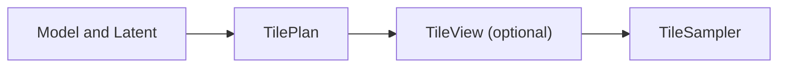

# Tiled Diffusion NG

The canonical home of this repository is at https://git.colorized.life/tiled-diffusion-ng/

Five ComfyUI nodes for tiled sampling, blending four overlapping views into
one full-resolution latent through a single KSampler trajectory.

```bash
cd /path/to/ComfyUI/custom_nodes
git clone https://git.colorized.life/tiled-diffusion-ng.git tiled-diffusion-ng
# Restart ComfyUI.
```

## Supported models

| Model | Supported | ControlNets |
| --- | :---: | :---: |
| SDXL | ✅ | ✅ native Apply Controlnet |
| Anima | ✅ | ✅ TileAnimaLLLiteApply |
| Krea2 | ✅ | ✅ TileKrea2Conditioning |

SDXL support covers base models and ordinary RGB SDXL ControlNet.

## Nodes

| Display name | Node ID | Inputs → output |
| --- | --- | --- |
| TilePlan | `TiledDiffusionNG_TilePlan` | `model`, `latent`, `tile_overlap` → TILE_PLAN |
| TileView | `TiledDiffusionNG_TileView` | `image`, `tile_plan` → IMAGE batch |
| TileSampler | `TiledDiffusionNG_TileSampler` | KSampler inputs, `tile_plan`, optional `local_positive` → LATENT |
| TiledAnimaLLLiteApply | `TiledDiffusionNG_TiledAnimaLLLiteApply` | `model`, `model_patch`, `tile_plan`, `reference_tiles`, strength and schedule → MODEL |
| TileKrea2Conditioning | `TiledDiffusionNG_TileKrea2Conditioning` | `clip`, `reference_tiles`, optional `prompts`, strength, schedule and downsizing → CONDITIONING list |

## Workflow

Connect the same model and target latent to the planner and sampler. The plan
creates four overlapping views in clockwise order: **TL, TR, BR, BL**. Overlap
is the shared width in pixels, default **64**. Gaussian weights blend predictions
at every model evaluation.



Vision views are optional and require a reference image matching the plan's full
pixel dimensions. External nodes can turn those views into an execution list of
four complete positive conditionings in tile order. Each replaces the global
positive for its tile; the negative stays shared. Without local positives, all
four tiles use the global positive.

Upscale the output latent externally and create a fresh plan to refine again,
or decode it to an image.

## License

Copyright © 2026 Lany Atwood <lany@colorized.life>. The project's Python source
and tests are licensed under [AGPL-3.0-only](LICENSE).

Based on the Mixture of Diffusers equations by Álvaro Barbero Jiménez, with an
independently written Gaussian and fusion implementation. See
[COPYRIGHT](COPYRIGHT) for algorithm references and attribution.
